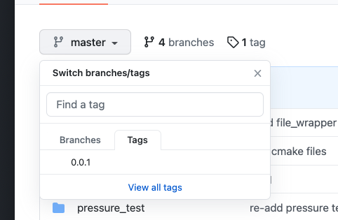

# WebKish

-------

WebKish是一个运行在Linux系统上基于现代C++11标准的一个natvie高性能多线程并发服务器框架，代码的编写采用面向对象设计方式，每一个连接对应一个handler，并且handler自己管理着文件描述符的生命周期，断开连接会自动关闭该文件描述符，该框架既可以用作tcp服务器也可以用作http服务器。

其核心来自于Linux2.6之后新增的系统调用epoll，当然也可以实现select和poll版本的poller，继承即可。

WebKish拥有完善的异步日志系统，在Apple mini M1版的parallels Desktop虚拟机安装的Fedora操作系统中（2个CPU核心），并发写入500W条数据用了不到2s的时间，思路借鉴了[linyacool](https://github.com/linyacool/WebServer)。

整个项目的核心框架借鉴了开源的web服务框架：[muduo](https://github.com/chenshuo/muduo), 所以该框架是响应式的，并且CPU占用率很小，但不影响它的高并发和高性能，编写更加简洁更加完善，自己也封装了Linux的pthread库，以及实现了一个简单版本的线程池。

http服务器有一个同步的loop timer，每隔一定的时间会检查连接队列的最新心跳时间，如果设置了timeout，将会根据timeout来进行过期淘汰，keep-alive将保持永久连接，除非对端主动断开，而一次性的请求将会被直接移除，间隔检查时间暂时设置为10ms，可以在服务器启动前自己更改。

http报文的解析采用了开源库[llhttp](https://github.com/nodejs/llhttp), 并对该库做了一个较为完善的封装，该部分花了我不少的精力。

## 安装webkish组件

### 必要库

因为webkih包含对mysql的API封装，所以请确保你有mysql的API库：mariadb库，以及pthread库

> mariadb库的安装：以我的fedora为例
>
> ```bash
> sudo yum install -y community-mysql
> sudo yum install -y community-mysql-server
> sudo yum install -y mysql-devel
> ```
>
> 可以使用：
>
> ```bash
> mysql_config --flags --libs
> ```
>
> 查看mysql的devel库安装成功了没

Webkish-0.0.1-release版本已经基本实现了http常见的功能，所以安装webkish请使用0.0.1的TAG：



1. 首先git clone仓库到你要运行的Linux机器上：

   ```bash
   git clone https://github.com/Kish29/WebKish.git
   ```

2. 进入WebKish目录

   ```bash
   cd WebKish
   ```

3. 切换到0.0.1分支

   ```bash
   git checkout 0.0.1
   ```

4. 将build- release目录下的三个文件移动到WebKish工程的根目录

   ```bash
   mv build-release/install.kish build-release/CMakeLists.txt build-release/webkish.pc.in .
   ```

5. 然后使用bash脚本安装即可，记得需要root权限才能将头文件和动态库安装到usr/local目录下

   ```bash
   sudo bash install.kish
   ```

   

可以看到lib库在64位机子上安装到了/usr/local/lib64/kish，32位应该是/usr/local/lib/kish，而头文件默认是/usr/local/include/kish
install成功后，/usr/local/lib64/kish路径(32位应该是：usr/local/lib/kish，)下会有三个动态连接库
```bash
libkish.so  libksql.so libthird_pt.so
```

## 接入开发
如果你是cmake工程，使用target_link_libraries链接这三个动态库即可：


WebKish的http接入很简单，只需要包含 "kish/http_server.h"用于创建http服务器，然后包含"kish/http_interface.h"这个头文件，用于实现请求接口，http_interface.h文件中定义了两个接口：


### 各举一个例子

1. 比如我要实现一个静态文件的resolver，表示请求的都是一些文件，把这些文件信息返回给客户端：

```c++
// 首先该类继承自http_resolver类：
#include "http_interface.h"

class example_files_resolver : public kish::http_resolver {
public:
  	// src_dir 表示目录的前缀
    explicit example_files_resolver(const char *src_dir) : file_src_dir(src_dir) {}

    bool can_resolve(const string &uri) override;

    void on_request(const kish::http_request_ptr &, kish::http_response &response) override;

private:
    const string file_src_dir;

    string curr_file_mime_type{MIME_T_TXT};
};

// 然后实现这两个方法
bool example_files_resolver::can_resolve(const string &uri) {
    if (!file_reader) {
        file_reader = new kish::file_wrapper();
    }
    if (file_reader) {
        // 首先判断本路径下该文件是否存在
        string target_file(file_src_dir);
      	// 拼接文件完整路径
        target_file.append("/");
        if (uri == "/") {	// 如果是根目录，默认打开index.html
            target_file.append("index.html");
        } else {
            target_file.append(uri);
        }
        if (file_reader->open(target_file.c_str(), kish::READONLY)) {
          	// 记录当前文件的类型
            curr_file_mime_type = get_file_mime_type(target_file.c_str());
            return true;	// 返回true，表示能够解析该uri请求
        } else {
            return false;	// 返回false，表示解析失败，不能接受该请求
        }
    } else return false;
}

// 如果can_resolve返回false，该方法是不会被调用的
void example_files_resolver::on_request(const kish::http_request_ptr &, kish::http_response &response) {
    ...
    // 读取文件数据
    flen = file_reader->read_unlock(fbuf, file_size);
  	// response的contents是body数据
    response.contents.emplace_back(string(fbuf, flen));
  	// 设置内容的类型，比如文本、html、图片，不设置默认是文本格式
  	response.set_content_type(curr_file_mime_type);
  	// 设置内容长度
    response.headers.insert(std::make_pair("Content-Length", std::to_string(flen)));
    // 关闭文件
  	file_reader->close();
    ...
}

```
2. 如果我想实现接口的请求，请实现http_interface类:

```c++
#include "http_interface.h"

using namespace kish;

class example_users_interface : public kish::http_interface {
public:

    void on_reg_in(http_interface_holder &holder) override;

    void user_login(const http_request_ptr &request, http_response &response);

    void user_regis(const http_request_ptr &request, http_response &response);

private:
    size_t login_times{0};
    size_t reg_times{0};
};

// on_reg_in方法会在reg_http_interface的时候调用，所以在这时候
// 注册我们要实现的方法，传入uri，接口，请求方法的类型
void example_users_interface::on_reg_in(http_interface_holder &holder) {
    holder.regin("/users/login", infc_type_t{
            .infc = std::bind(&example_users_interface::user_login, this, std::placeholders::_1, std::placeholders::_2),
            .method = HTTP_POST});
    holder.regin("/users/reg", infc_type_t{
            .infc = std::bind(&example_users_interface::user_regis, this, std::placeholders::_1, std::placeholders::_2),
            .method = HTTP_POST});
}

void example_users_interface::user_login(const http_request_ptr &request, http_response &response) {
    login_times++;
    response.update_stat(200);
    response.contents.emplace_back("登陆成功");
    response.set_content_type_with_charset(MIME_T_TXT);
}

void example_users_interface::user_regis(const http_request_ptr &request, http_response &response) {
    reg_times++;
    // 获取请求的内容类型
    const string &type = request->get_content_type();
    // 如果是json格式
    if (type == MIME_A_JSON) {
        // 注意！所有的强制转化，必须要进行异常catch，否则强转失败抛出异常导致本线程异常退出！
        try {
            // 将参数转化为json对象
            auto param_json = (CJsonObject) request->get_param(http_message::JSON_PARAM);
            string password;
            // 获取value
            param_json.Get("password", password);
            printf("password: %s\n", password.c_str());
            string username;
            param_json.Get("username", username);
            printf("username: %s\n", username.c_str());
            response.update_stat(200);
        } catch (const std::bad_cast &e) {
            response.update_stat(400);
        }
    } else {
        try {
            // 其他类型，获取想要的参数，转换即可
            string username = (string) request->get_param("username");
            string password = (string) request->get_param("password");
            printf("username: %s\n", username.c_str());
            printf("password: %s\n", password.c_str());
            response.update_stat(200);
        } catch (const std::bad_cast &e) {
            response.update_stat(400);
        }
    }
}

```

然后，在执行前通过reg_http_resolver方法注册resolver和interface就OK了（传入一个shared指针）：

```c++
int main() {
  KISH_CONFIG.setKishServerName("example_webserver");	// example：更改服务器名称
  
  // 注册resolver
  reg_http_resolver(http_resol_ptr(
    new example_files_resolver("/home/parallels/webserver/static_docs")));	
  
  // 注册用户接口
  reg_http_interface(http_intc_ptr(new example_users_interface));
  // 开启8个looper（即8个epoll fd）
  kish::http_server hs(7777, 8);	// 创建服务器，工作在端口7777，默认地址0.0.0.0

  hs.startup();		// 运行服务器
}
```

> 本例子在[example](example)文件夹里有完整代码

## 压力测试

对服务器进行http的请求压力测试，结果在这里[压力测试
