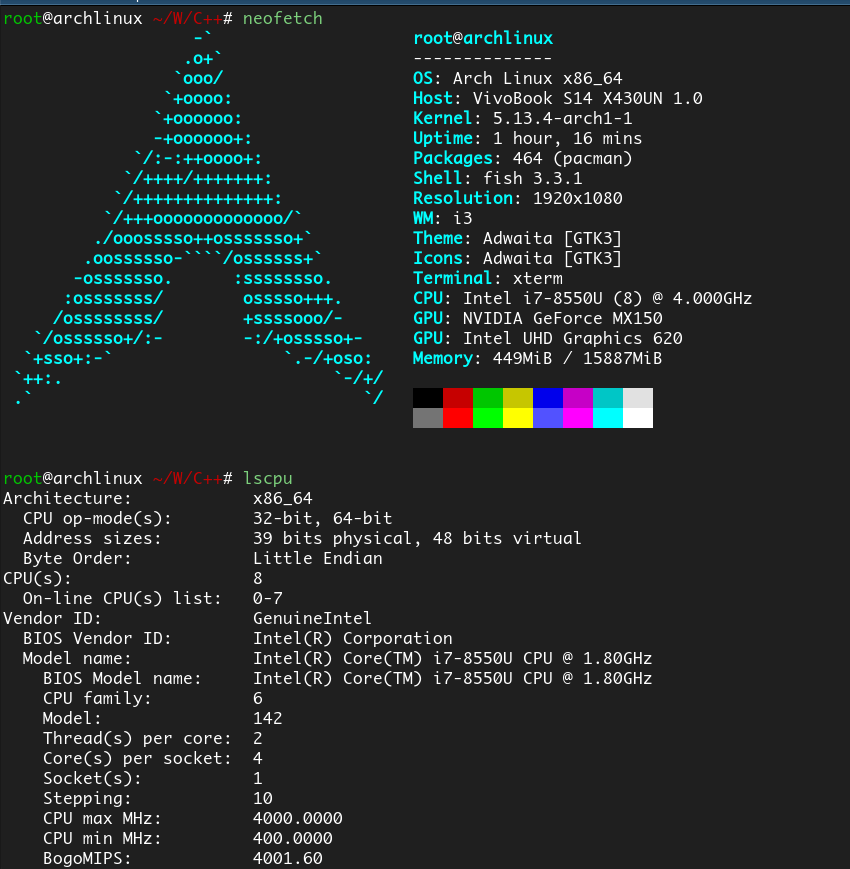
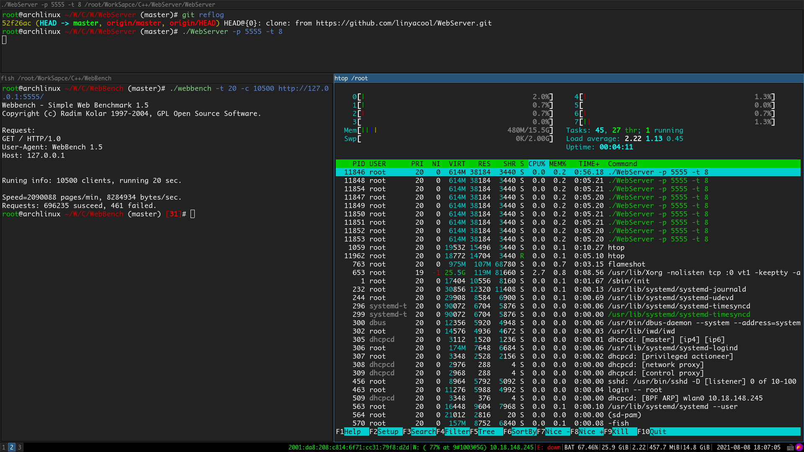
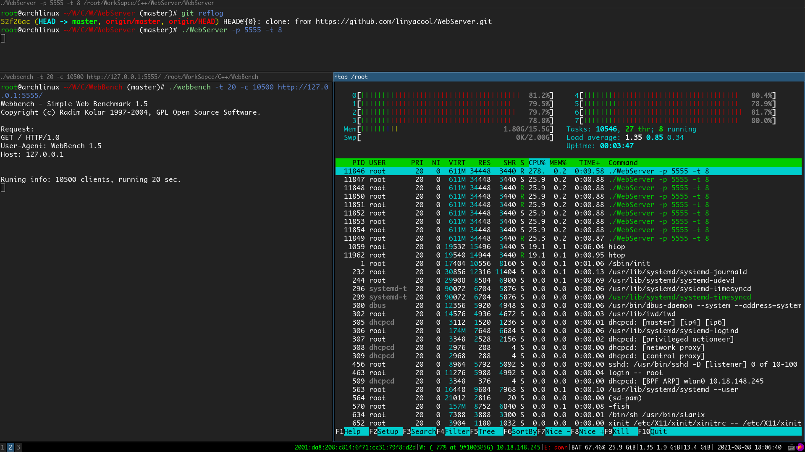
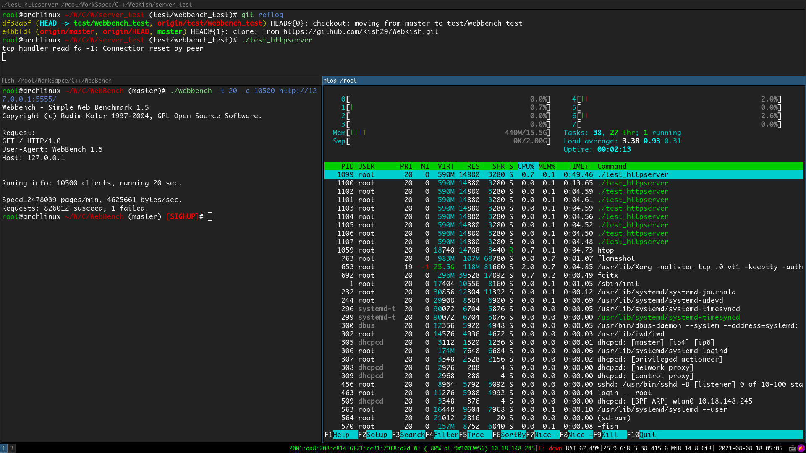
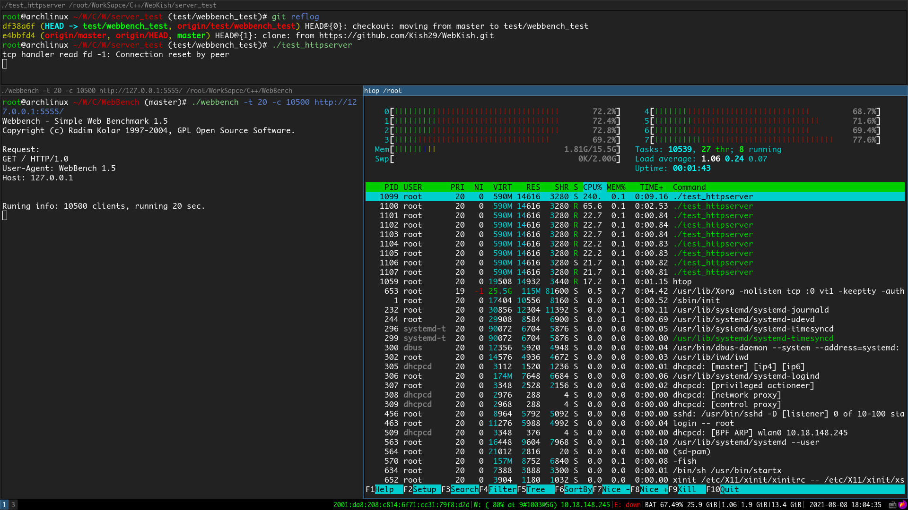

## 压测

对服务器进行压力测试，理想环境当然是通过两台机器连接测试，但由于路由器带宽等限制，最后决定像linyacool一样，参考本地测试，因为不同的机型由于CPU性能以及内存等问题，结果会不一样（比如我的Apple就fork不了1万个线程进行并发测试），所以需要有一个对照的webserver，选择的是linyacool的WebServer克隆到本地，去掉日志系统和输出后进行对照测试。

--------

## 1. 测试环境：

使用我大学用了3年的华硕小本本进行测试

CPU：Intel i7-8550U 4核8线程 频率4.0GHz

内存是16GB，具体如图

## 2. 测试工具

使用开源工具webbech，git客隆自EZLippi

## 3. 测试

两个服务器独立测试（即一个测完测另一个），looper的数量都是8个，两个服务器的代码优化均为O3，关闭-g选项，关闭log日志

客户端并发连接数：10500

测试时间：20s

http版本：HTTP/1.0，一次性请求

测试结果：

### a. linyacoolWebServer

QPS：3.48万，其中失败的请求数461

具体如图：

CPU的占用：80%左右

### b. WebKish

QPS：4.13万，其中失败请求数1

具体如图：

CPU占用：70%左右

## 结论
对高并发的请求，性能还是不错的，因为linyacool这个WebServer的短连接性能要比muduo好一些，推测webkish的短连接性能相比muduo也不会差很多。
长连接没有测试，没有去改webbench的代码。
