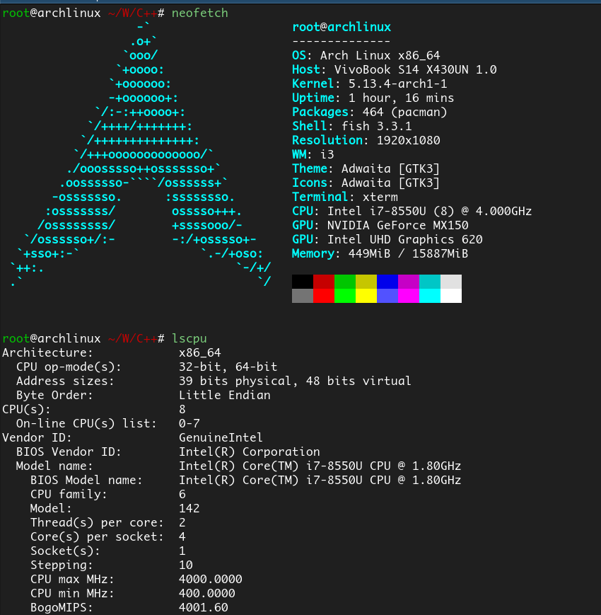
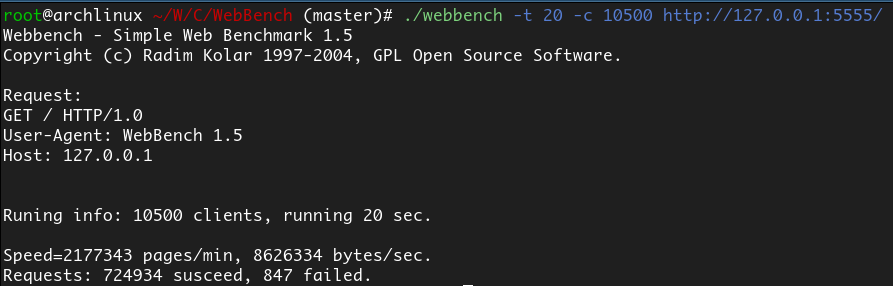
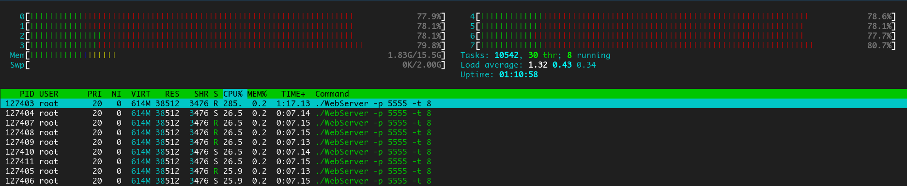
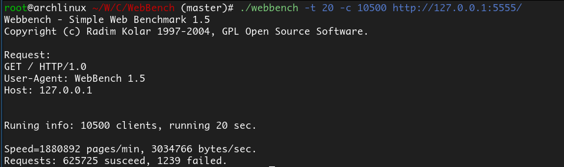
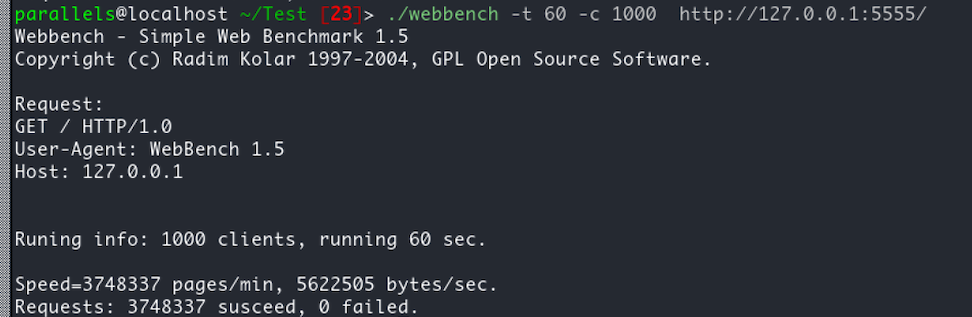
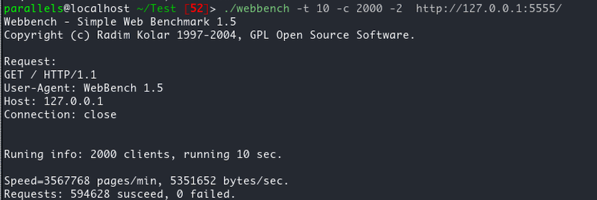
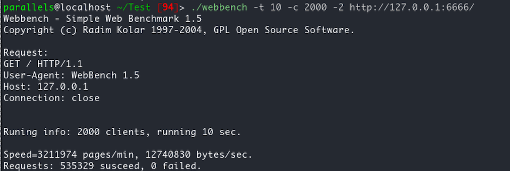

## 压测

对服务器进行压力测试，理想环境当然是通过两台机器连接测试，但由于路由器带宽等限制，最后决定像linyacool一样，参考本地测试，因为不同的机型由于CPU性能以及内存等问题，结果会不一样（比如我的Apple就fork不了1万个线程进行并发测试），所以需要有一个对照的webserver，选择的是linyacool的WebServer克隆到本地，去掉日志系统和输出后进行对照测试。

--------

## 1. 测试环境：

使用我大学用了3年的华硕小本本进行测试

CPU：Intel i7-8550U 4核8线程 频率4.0GHz

内存是16GB，具体如图

## 2. 测试工具

使用开源工具webbech，git客隆自EZLippi

## 3. 测试
两个服务器独立测试（即一个测完测另一个），looper的数量都是8个

客户端并发连接数：10500

测试时间：20s

http版本：HTTP/1.0，一次性请求

测试结果：

### a. linyacoolWebServer

QPS：3.6万，其中失败的请求数847

具体如图：

htop查看CPU的占用：76%左右

### b. WebKish

QPS：3.1万，其中失败请求数1239

具体如图：

htop查看CPU占用：65%左右

> 9个线程其中8个是looper线程，1个是主线程，负责不断地冲连接队列中检查过期连接并设置死亡标记

## 结论

相比于别人的优秀服务器，还是有不少的差距的，毕竟自己是第一次编写web框架，时间上也比较仓促，只用了差不多半个月，C++用的也不是很熟练，当然还是自己对网络/IO/操作系统这块儿的理解还需要进一步加深。

> 我对每一个connfd没有设置nondely（即关闭Nagle算法），那么在响应数据量少的情况下，会不会对服务器的性能有影响？我看linyacool的web源码时倒是设置了的。emmmm。。。。

--------

题外话：

在我的Apple Mini M1版上装的Fedora虚拟机（4核 4GB内存）上进行 1000个并发连接，持续请求60秒的测试（本地测试），发现webkish的性能反而要比linyacool的好一些，并且其他测试情况也是一样。。。。。

### webkish

1000个客户端持续60秒请求

2000个客户端持续10秒请求

### linyacoolWebserver

1000个客户端持续60秒请求

2000个客户端持续10秒请求

猜测机型对结果的可能有不小的影响。
